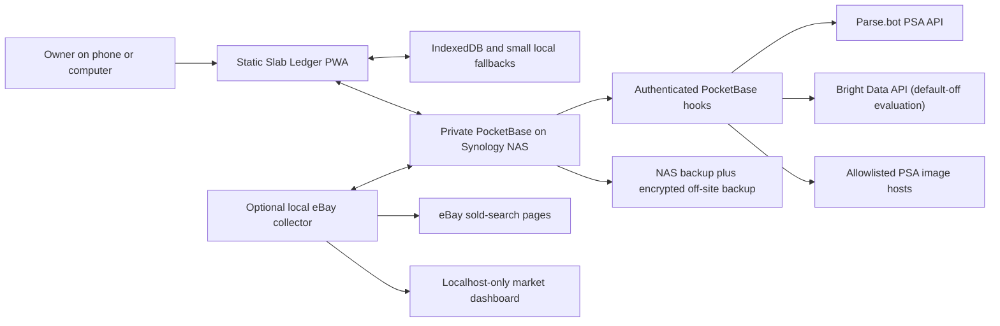

# Slab Ledger Architecture

## Purpose

Slab Ledger is a private, mobile-first progressive web app for graded-card
inventory, valuation, sales, grading reminders, and lightweight business
records. The design favors personal control, graceful offline behavior, and a
small understandable stack over a large framework or public cloud platform.

## System context

The browser never receives provider API keys. PocketBase is reachable only
through the owner's private Tailscale network. The optional collector is not a
backend dependency for normal inventory, ledger, or manual valuation work.

## Technology stack

### Frontend

- static HTML, CSS, and dependency-light browser JavaScript;
- root `index.html` as the application shell;
- feature modules under `ebay-dashboard/`;
- Web App Manifest for installable/PWA behavior;
- IndexedDB for local inventory and photo-capable offline storage;
- local/session storage for small settings, cached auth, migration state, and
  offline fallbacks;
- ZXing in the browser for PSA QR scanning;
- ExcelJS in the browser for XLSX export with embedded photos;
- Google Fonts for the current visual system.

The external browser libraries are pinned and loaded with Subresource Integrity,
`crossorigin="anonymous"`, and `referrerpolicy="no-referrer"`.

### Backend and storage

- PocketBase running in a Synology container;
- PocketBase `users` authentication;
- owner-scoped collections and protected file fields;
- PocketBase JavaScript hooks for authenticated third-party access;
- Python setup utility using `requests` for idempotent schema preparation.

### Optional marketplace companion

- Python 3;
- `requests`, Beautiful Soup, and Playwright;
- an unpacked extension in the owner's normal signed-in Google Chrome profile;
- a random localhost-only extension pairing key;
- an owner-configurable local window, all-day default, and visible
  manual-check pause;
- a loopback-only `ThreadingHTTPServer`;
- local JSON cache and rotating operational state;
- PocketBase synchronization using an app-user account.

### Hosting and networking

- static frontend hosted by GitHub Pages or a trusted equivalent;
- PocketBase privately exposed with Tailscale Serve;
- no Tailscale Funnel or public NAS port forwarding;
- Synology Hyper Backup for encrypted off-site copies.

## Repository layout

| Path | Responsibility |
| --- | --- |
| `index.html` | PWA shell, inventory UI, IndexedDB, PocketBase sync, QR intake, exports |
| `manifest.webmanifest` | installable app metadata |
| `ebay-dashboard/slab-ledger-market.js` | manual/PSA market-value UI and history |
| `ebay-dashboard/slab-ledger-portfolio.js` | total collection-value history chart |
| `ebay-dashboard/slab-ledger-profile.js` | synced owner name and protected logo |
| `ebay-dashboard/business-ledger.js` | business ledger, receipts, tax-year summaries, exceptions |
| `ebay-dashboard/slab-ledger-tools.js` | navigation, capital, percentages, balances, theme |
| `ebay-dashboard/grading-plays.js` | simplified grading tracker and protected photos |
| `ebay-dashboard/pb_hooks/slab_ledger_psa.pb.js` | authenticated PSA lookup, sales, credits, image relay, grading reads |
| `ebay-dashboard/pb_hooks/slab_ledger_marketplace.pb.js` | authenticated marketplace evaluation, budgets, usage, private cache and observations |
| `ebay-dashboard/pb_hooks/lib/` | provider-neutral marketplace core and isolated Bright Data adapter |
| `ebay-dashboard/setup_pocketbase.py` | non-destructive schema/security installer |
| `ebay-dashboard/bright_data_validate.py` | account metadata inspection without consuming scraper records |
| `ebay-dashboard/scraper.py` | optional paced eBay collector and localhost dashboard |
| `ebay-dashboard/POCKETBASE_SETUP.md` | operator setup instructions |

## Application modules

The app intentionally avoids a bundler and large client framework. Feature
modules attach narrow integration functions to `window` where the root shell
must call them. This is pragmatic for the current app size, but new work should
avoid adding more global state than necessary.

Script query strings in root `index.html` are cache-busting release identifiers.
Increment the relevant value when changing an external module so installed or
cached clients receive the update.

## Data architecture

### Inventory

PocketBase `cards` is authoritative for signed-in users. A card contains:

- owner;
- grading company and certification number;
- full display name and separate editable eBay search keywords;
- grade and population;
- acquisition cost and date;
- notes;
- active/sold state;
- sale price/date, platform fees, shipping, and sale notes;
- optional Parse.bot sales estimate metadata;
- protected front and back photos.

The browser keeps an in-memory newest-first working list and mirrors cards into
IndexedDB. A legacy local-storage inventory migrates once into IndexedDB.
Offline changes use local IDs and deletion markers; cloud records retain their
PocketBase IDs. Sync reconciles remote authority with pending local work rather
than making the UI network-only.

The certification number is the natural duplicate-warning key within a grading
company, while the PocketBase record ID remains the storage identity.

### Market values

`market_values` stores one current record per owner/card and includes:

- normalized query and search URL;
- market value, confidence, checked time, low/high range;
- accepted and rejected counts;
- the latest exact sold match as the current value;
- a rolling maximum of three confirmed sold listings and three exact active
  asking prices;
- bounded review candidates that never affect value without owner confirmation;
- source and notes;
- bounded value history;
- last safe error.

Manual values and provider-derived values share the same normalized record so
charts and exports do not depend on a provider.

Bright Data evaluations do not write `market_values` automatically. The
authenticated hook returns normalized candidates to the existing review form;
the owner must explicitly save an accepted value. Owner-only supporting
collections store daily/monthly usage, bounded recent activity, short-lived
search cache entries, and normalized observations. A scheduled server task
removes expired cache, activity, and observation records.

`marketplace_refresh_settings` remains available for managed-provider
evaluation. The deployed local collector instead runs one owner-configured
nightly cycle, starting at 2:00 AM by default. Each card receives one sold
lookup and one active-listing lookup, paced across the cycle.
`marketplace_refresh_state` stores per-card due time and the last safe outcome.
A PocketBase cron checks for due work every 15 minutes, processes only a bounded
number of active cards, and advances each processed card independently. It
stores evaluation observations and cache entries, never an automatic trusted
market value.

`marketplace_collector_status` stores an owner-private heartbeat and safe
attention state for offline, cooldown, CAPTCHA/sign-in, and collector errors.

The local browser collector keeps provider transport replaceable. It promotes
only a listing whose title matches the structured PSA identity, preserves the
previous trusted value after empty or failed searches, and sends incomplete but
plausible identity matches to owner review.

### Portfolio history

The portfolio chart reconstructs total collection value over time from each
card's acquisition time and saved market-value history. It is intended to show
true collection value changes, not merely the amount paid.

### Business records

- `business_entries`: expenses, contributions, draws, other income, loan
  activity, notes, and protected receipts;
- `business_exceptions`: year-end reminders for unusual personal/business
  account movements;
- `debt_reminders`: informal owed-to-me and I-owe reminders;
- `app_preferences`: owner profile, capital reminders, and Parse.bot usage
  synchronization.

These features organize records but do not determine tax treatment. Original
receipts, statements, and professional advice remain authoritative.

### Grading records

`grading_items` is the current simple tracker:

- raw card name and optional protected photo;
- quantity;
- raw cost per card;
- grading cost per card;
- notes and calculated estimated all-in cost.

The older `grading_plays`, `grading_play_cards`, and `grading_play_sales`
collections remain for data preservation but are not the primary current UI.
Do not delete them automatically.

## Synchronization model

1. The app opens IndexedDB and renders cached inventory immediately.
2. If an auth session exists, it requests PocketBase records with the bearer
   token.
3. Remote records are normalized into the browser model.
4. Protected files are downloaded using short-lived file tokens and converted
   to local object URLs or cached blobs where appropriate.
5. Local pending changes are uploaded with the authenticated user's owner ID.
6. Network/focus events schedule a refresh without deliberately blanking the
   last known good UI.

PocketBase rules, not the sync code, enforce tenancy.

## PSA intake flow

1. The user scans the square PSA QR code or enters a cert number.
2. The browser extracts and validates an 8–10 digit certification number.
3. An authenticated request is sent to the PocketBase hook.
4. The hook supplies its server-side Parse.bot key and normalizes the result.
5. The app fills title, structured search terms, grade, population, and
   available front/back photos.
6. The image relay imports only allowlisted public PSA images.
7. If lookup fails, the UI offers manual cert-page entry and user photo upload.

QR is the supported scan-first experience. Barcode scanning was tested and
retired because phone reliability was inadequate.

## Search architecture

There are three related but distinct search paths:

1. **Inventory search**
   - immediate client-side filtering of the in-memory inventory;
   - searches company, cert, name, grade, population, notes, dates, and values.

2. **Human marketplace research**
   - builds concise, editable seller-style keywords;
   - opens eBay Product Research with sold results ordered most recent first;
   - preserves the full PSA title separately.

3. **Automated valuation**
   - broad structured query retrieves candidate sold listings;
   - local normalization/filtering verifies grader, grade, card keywords, and
     replica exclusions;
   - identity and edition rules reject mismatches;
   - genuine price dispersion is labeled as volatility rather than silently
     deleting scarce-card sales;
   - current estimate uses the most recent accepted comparables;
   - the record stores confidence, range, counts, source, and error context.

Bright Data implements the retrieval side of path 3 behind a default-off
provider contract. Synchronous requests are supported when confirmed by the
account scraper. Asynchronous requests use outbound trigger/progress/snapshot
polling only; no public callback is required.

Scheduled checks use the same provider contract, cache, normalization,
rejection rules, returned-record accounting, budgets, and cooldowns as a manual
evaluation. Twelve hours represents twice daily and one day represents once
daily; longer custom hour, week, and month intervals are supported.

See `docs/Marketplace.md`.

## Authentication and authorization

- Browser login: PocketBase `users/auth-with-password`.
- Admin setup: `_superusers/auth-with-password`, with PocketBase OTP/MFA support.
- User token: cached locally for session continuity and sent as `Authorization`.
- Server rules: owner-scoped on all user data.
- Protected files: short-lived PocketBase file tokens.
- Hooks: authenticated `users` routes plus server-side owner filters.

The browser is not trusted to enforce ownership.

## Environment strategy

Secrets are injected at runtime and never bundled:

- Parse.bot key and optional monthly allowance live in the PocketBase/container
  environment.
- Collector credentials and backend settings live in ignored `collector.env`.
- The setup utility saves only the non-secret PocketBase URL and superuser email
  in ignored `pocketbase-setup.env`.

Examples contain placeholders only. The current frontend contains the private
PocketBase base URL because this is a personal deployment; making it
configuration-driven is a roadmap hardening item, not an invitation to make
that endpoint public.

## Deployment assumptions

- The root site is published as static assets.
- The Synology has persistent mounts for the PocketBase executable/hooks and
  `pb_data`.
- `pb_hooks` is located beside the executable or supplied with `--hooksDir`.
- PocketBase launches with a restricted `--origins` value matching the static
  site.
- Tailscale must be connected on client devices.
- PocketBase rate limiting, superuser MFA, automatic backups, and off-site
  backup are enabled.
- Schema changes are applied with the repository setup utility after a backup.

## Error handling

- UI errors are plain-language and actionable.
- Offline state keeps cached data visible.
- Provider errors do not erase good manual/current values.
- Network requests use explicit timeouts at server and collector boundaries.
- Authentication failures cause reauthentication rather than authorization
  bypass.
- File errors are repaired through token/loading logic, not public file access.
- Collector block signals trigger cooldowns.
- Mutable collector JSON is written atomically.

## Logging

The browser does not maintain a general persistent log because it contains
private user activity. Important user-facing status appears in the UI.

The collector writes timestamped INFO/WARNING records to ignored local logs.
Failure screenshots/HTML are local diagnostics. Logs must exclude credentials,
tokens, provider keys, cookies, and private receipt/financial contents.

Future server/provider logging should use structured events with:

- timestamp;
- severity;
- subsystem;
- operation;
- safe owner/card/query correlation ID;
- provider;
- latency;
- accepted/rejected count;
- outcome/error category;
- rate-budget and retry/cooldown state.

## Design philosophy

- private by default;
- manual fallback over provider lock-in;
- mobile-first and touch-friendly;
- calm, compact, legible UI;
- fast cached render before network refresh;
- visible source/confidence instead of false precision;
- additive migrations and data preservation;
- simple operations for a non-technical owner;
- no security weakening to make a feature appear to work.
